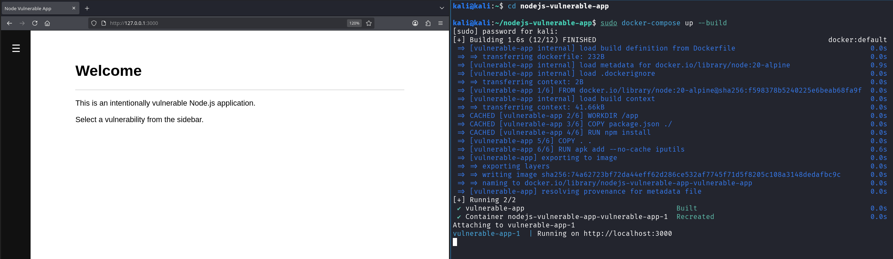

# NodeJS Vulnerable App

Intentionally vulnerable NodeJS application with a collection of web vulnerabilities where you can practice on.

## Labs Overview

| Vulnerability | Description | Blog Post |
|---------------|-------------|-----------|
| Command Injection | Network Diagnostic Tool vulnerable to command injection | https://redteamworld.com  |

## Run

In order to run the application you just require docker, and run the following commands.

### Docker compose 

```bash
# Run from the repo folder
git clone https://github.com/redteamworld/nodejs-vulnerable-app.git
cd nodejs-vulnerable-app
docker-compose up --build 
```

The NodeJS application will run at http://127.0.0.1:3000

